# Hi, I'm 高艳兵 👋

🧩 **Ant Design Team Member** | 💻 **前端工程师** | 📮 [yanbing.gao@aliyun.com](mailto:yanbing.gao@aliyun.com) · [gaoyanbing.cc@gmail.com](mailto:gaoyanbing.cc@gmail.com)

2018 年开始从事前端开发，多年来主要使用 React 与 TypeScript 构建中后台应用和组件库，并持续参与开源建设。目前正在从零构建富文本编辑内核，同时沉淀现代 React 应用的工程基线。

## 近期工作

- **Ant Design 生态** — 持续参与 [Ant Design](https://github.com/ant-design/ant-design)、[Ant Design X](https://github.com/ant-design/x) 与 [react-component](https://github.com/react-component) 的建设，关注组件 API、样式语义、交互细节、测试体系与工程质量。 
  `TypeScript` `React`
- **[crucialy-rich](https://github.com/QDyanbing/crucialy-rich)** — 从零构建富文本编辑内核与 React 组件，推进文档模型、选区、Operation、Command、History 与浏览器输入闭环。 
  `TypeScript` `React`
- **[react-project-template](https://github.com/QDyanbing/react-project-template)** — 面向中后台应用的 React 工程基线，覆盖认证、权限、国际化、Mock、测试、CI 与发布流程。 
  `TypeScript` `React` `Ant Design`
- **[vue-resize-container](https://github.com/QDyanbing/vue-resize-container)** — 兼容 Vue 2.7 与 Vue 3 的拖拽缩放容器，支持八向缩放、拖拽、最大化与父级边界约束。 
  `TypeScript` `Vue` `Vite`

## GitHub 动态

  

  

