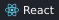

   
  

<table width="100%">
<tr>
<td width="38%" valign="top">
 
  ✉️ <a href="mailto:yanbing.gao@aliyun.com">yanbing.gao@aliyun.com</a> 
  ✉️ <a href="mailto:gaoyanbing.cc@gmail.com">gaoyanbing.cc@gmail.com</a>
</td>
<td width="62%" valign="top">

2018 年开始从事前端开发，多年来主要使用 React 与 TypeScript 构建中后台应用和组件库，并持续参与开源建设；

  
  
  
  
  
  
   
  
  
  
  
  
  
  

### 近期工作

- **参与开源项目** — 持续参与 [Ant Design](https://github.com/ant-design/ant-design)、[Ant Design X](https://github.com/ant-design/x) 与 [react-component](https://github.com/react-component) 的建设，关注组件 API、样式语义与交互细节，通过问题复现、功能改进和回归测试积累组件库开发经验。 `TypeScript` `React` `Ant Design`
- **前端模板** — 持续完善 [react-project-template](https://github.com/QDyanbing/react-project-template)，整理中后台应用的工程基线，覆盖认证、权限、国际化、Mock、测试与发布流程。 `React` `Vite` `Vitest` `Playwright`
- **安全合规业务** — 参与安全合规相关业务的前端开发，关注业务规则、权限边界与异常状态的交互反馈，兼顾可用性与可维护性。 `业务建模` `权限控制` `组件复用`
- **Agents 开发学习** — 学习 Agents 的任务拆解、工具调用与上下文管理，尝试将其用于资料整理、代码理解和开发辅助，关注执行过程是否可追踪、结果如何验证，以及哪些步骤需要人工确认。 `Agents` `工具调用` `效果验证`

</td>
</tr>
</table>

  

  

